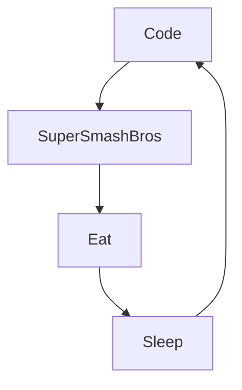

## Hey 👋, I'm Jawad MOHAMMAD!  
  

## 👀 Glad to see you here!  
With a background in Data Analytics, I discovered the world of DevOps & Cloud in 2020 and became passionate about it. I self-learned my way through it and have acquired 4 years of experience since then.

Being passionate and very curious, I regularly follow the latest trends and best practices of the tools and languages I use on a daily basis as well as the new tools that become available over the years. I also have several personal projects in Data and DevOps that I will be happy to present to you if you are interested.

## 💫 About Me:
🎓 Graduated with a Bachelor's degree in social sciences from Sciences Po Paris. 💻 4 years of experience as a DevOps & Cloud Engineer  💬 Ask me about anything, I like to talk !  ⚡ I'm fond of Pokemon (especially Garchomp) and I'm a main Roy on Super Smash Bros ultimate.
 
 

## 💻 Languages and tools:
 
      
              
 
<!-- Proudly created with GPRM ( https://gprm.itsvg.in ) -->

## ⏳ My Daily Routine  

# Hasta mañana 🌞, Iguana 🦎!
